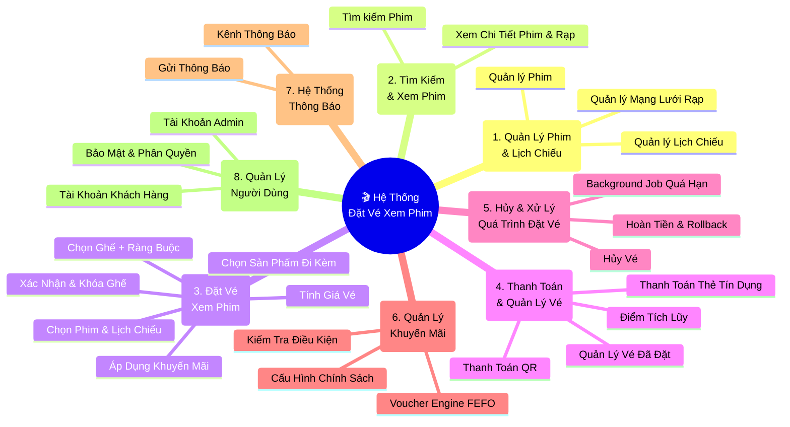
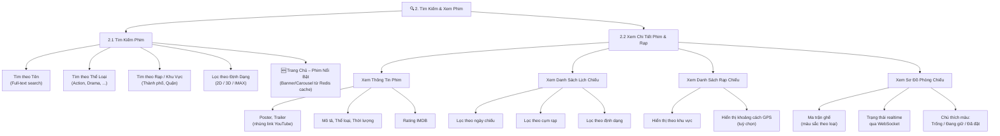
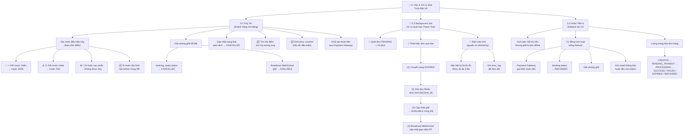
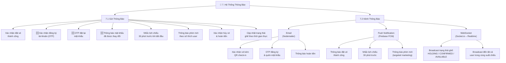
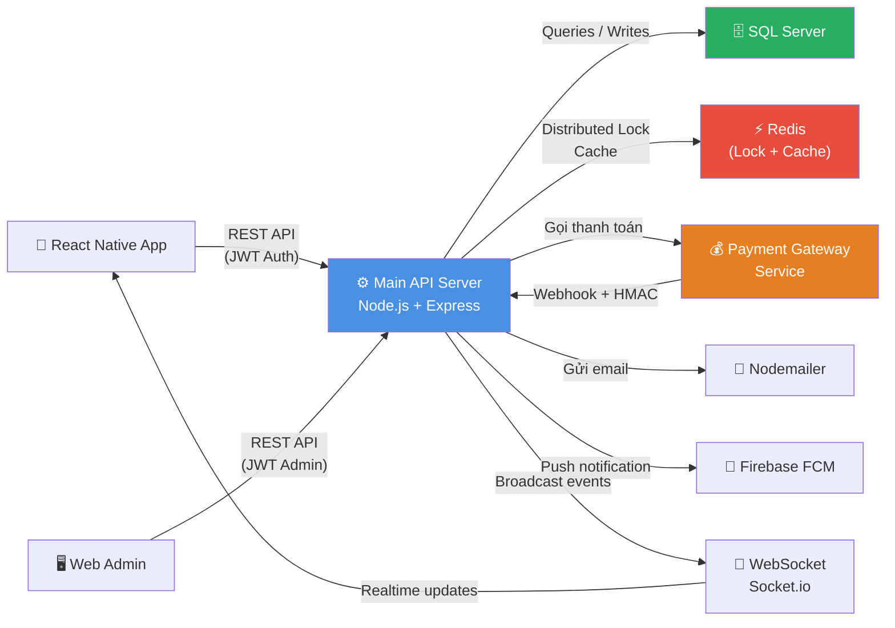

# 📊 BIỂU ĐỒ PHÂN RÃ CHỨC NĂNG – CHI TIẾT
## Hệ Thống Đặt Vé Xem Phim Đa Nền Tảng – Phiên Bản 2.0

> **Chú thích cấp độ:**
> - **L1** – Nhóm chức năng chính (8 module)
> - **L2** – Nhóm chức năng con
> - **L3** – Chức năng chi tiết
> - **L4** – Chức năng con / nghiệp vụ cụ thể
>
> 🆕 = Mới bổ sung | 🔄 = Đã cập nhật theo góp ý

---

## TỔNG QUAN – 8 MODULE CHÍNH

---

## MODULE 1 – QUẢN LÝ PHIM & LỊCH CHIẾU

```mermaid
graph TD
    M1["🎬 1. Quản Lý Phim & Lịch Chiếu"]

    M1 --> M1A["1.1 Quản Lý Phim"]
    M1 --> M1B["1.2 Quản Lý Mạng Lưới Rạp"]
    M1 --> M1C["1.3 Quản Lý Lịch Chiếu"]

    %% 1.1 Quản lý Phim
    M1A --> A1["Thêm phim mới"]
    M1A --> A2["Cập nhật thông tin\n(tên, mô tả, thể loại, poster, trailer)"]
    M1A --> A3["Cập nhật định dạng\n(2D / 3D / IMAX)"]
    M1A --> A4["Xóa phim\n(Soft delete – is_active=0)"]
    M1A --> A5["🆕 Quản Lý Phim Nổi Bật\n(Featured)"]

    A5 --> A51["Đánh dấu is_featured = 1"]
    A51 --> A511["Thiết lập thứ tự hiển thị\n(featured_order)"]
    A51 --> A512["Cache danh sách vào Redis\nTTL = 5 phút"]

    %% 1.2 Quản lý Mạng lưới Rạp
    M1B --> B1["Cấu Trúc 3 Tầng"]
    B1 --> B11["Tầng 1: Hệ Thống Rạp"]
    B1 --> B12["Tầng 2: Cụm Rạp"]
    B1 --> B13["Tầng 3: Phòng Chiếu"]

    M1B --> B2["Thêm / Sửa Cụm Rạp"]
    B2 --> B21["Nhập tên, địa chỉ, thành phố, quận"]
    B2 --> B22["Gắn toạ độ GPS (lat, lng)"]

    M1B --> B3["Thiết Lập Sơ Đồ Phòng\n(Ma trận hàng × cột)"]
    B3 --> B31["Gán loại ghế\n(standard / vip / couple)"]
    B3 --> B32["Đánh dấu lối đi (aisle)"]
    B3 --> B33["Đánh dấu khu vực trống (empty)"]
    B3 --> B34["Cấu hình phụ thu từng loại ghế"]

    %% 1.3 Quản lý Lịch Chiếu
    M1C --> C1["Thêm Lịch Chiếu Mới"]
    C1 --> C11["Chọn: Phim + Định dạng\n+ Phòng + Giờ bắt đầu"]
    C1 --> C12["Tự tính giờ kết thúc\n= Giờ bắt đầu + Thời lượng + 15p"]
    C1 --> C13["Kiểm tra xung đột thời gian\ncùng phòng chiếu"]

    M1C --> C2["Cập Nhật Lịch Chiếu"]
    C2 --> C21["Chỉ cho phép nếu\nchưa có vé đặt"]
    C2 --> C22["Lưu Audit Log\ntrước/sau thay đổi"]

    M1C --> C3["Xóa Lịch Chiếu"]
    C3 --> C31["Kiểm tra không có vé\ntrước khi xóa"]

    M1C --> C4["Cấu Hình Giá Suất Chiếu"]
    C4 --> C41["Giá cơ bản ngày thường"]
    C4 --> C42["Phụ thu cuối tuần"]
    C4 --> C43["Phụ thu theo định dạng\n(3D, IMAX)"]
```

---

## MODULE 2 – TÌM KIẾM & XEM PHIM

---

## MODULE 3 – ĐẶT VÉ XEM PHIM

```mermaid
graph TD
    M3["🎟️ 3. Đặt Vé Xem Phim"]

    M3 --> S1["Bước 1: Chọn Phim\n& Lịch Chiếu"]
    M3 --> S2["Bước 2: Chọn Ghế\n+ Ràng Buộc"]
    M3 --> S3["🆕 Bước 3: Tính Giá Vé"]
    M3 --> S4["Bước 4: Chọn Sản Phẩm\nĐi Kèm"]
    M3 --> S5["Bước 5: Áp Dụng\nKhuyến Mãi"]
    M3 --> S6["🔄 Bước 6: Xác Nhận\n& Khóa Ghế (Redis)"]

    %% Bước 1
    S1 --> S11["Chọn phim"]
    S1 --> S12["Chọn cụm rạp"]
    S1 --> S13["Chọn ngày & giờ chiếu"]
    S1 --> S14["Chọn định dạng\n(2D / 3D / IMAX)"]

    %% Bước 2
    S2 --> S21["Hiển thị sơ đồ ghế\n(Realtime / WebSocket)"]
    S2 --> S22["Kiểm tra trạng thái ghế\ntheo thời gian thực"]
    S2 --> S23["🔄 Ràng Buộc Vị Trí Ghế"]
    S23 --> S231["❌ Cấm tạo 1 ghế trống\nđơn lẻ nằm giữa / sát mép"]
    S23 --> S232["🆕 ❌ Cấm tạo 2 ghế trống\nliên tiếp bị kẹp giữa"]
    S23 --> S233["⚠️ Cảnh báo vi phạm\n& yêu cầu chỉnh sửa"]

    %% Bước 3 - MỚI
    S3 --> S31["Lấy giá cơ bản suất chiếu"]
    S3 --> S32["Cộng phụ thu theo ngày"]
    S32 --> S321["Ngày thường: +0đ"]
    S32 --> S322["Cuối tuần (T7/CN): +phụ thu"]
    S3 --> S33["Cộng phụ thu theo định dạng"]
    S33 --> S331["3D: +phụ thu"]
    S33 --> S332["IMAX: +phụ thu cao hơn"]
    S3 --> S34["Cộng phụ thu loại ghế"]
    S34 --> S341["Ghế thường: +0đ"]
    S34 --> S342["Ghế VIP: +phụ thu"]
    S34 --> S343["Ghế Couple: +phụ thu cao hơn"]
    S3 --> S35["Hiển thị bảng chi tiết giá\ntừng ghế + tổng cộng"]

    %% Bước 4
    S4 --> S41["Hiển thị danh sách\nbắp / nước / combo"]
    S4 --> S42["Chọn số lượng từng sản phẩm"]
    S4 --> S43["Cập nhật tổng tiền tạm tính"]

    %% Bước 5
    S5 --> S51["Auto-suggest Voucher\n(FEFO – sắp hết hạn nhất)"]
    S5 --> S52["Chọn voucher từ kho\nhoặc nhập mã thủ công"]
    S5 --> S53["Kiểm tra điều kiện hợp lệ"]
    S5 --> S54["Cập nhật giá sau khi giảm"]

    %% Bước 6
    S6 --> S61["Hiển thị thông tin\ntổng hợp đặt vé"]
    S6 --> S62["Xác nhận thông tin"]
    S6 --> S63["🔄 Khóa ghế tạm thời\n(Redis TTL = 10 phút)"]
    S63 --> S631["SET NX – Atomic\nngăn race condition"]
    S63 --> S632["Ghi PENDING_PAYMENT\nvào Database"]
    S63 --> S633["Broadcast WebSocket:\nghế → trạng thái HOLDING"]
    S6 --> S64["Chuyển sang thanh toán"]
```

---

## MODULE 4 – THANH TOÁN & QUẢN LÝ VÉ

```mermaid
graph TD
    M4["💳 4. Thanh Toán & Quản Lý Vé"]

    M4 --> M4A["4.1 Thanh Toán QR\n(MoMo / VNPay)"]
    M4 --> M4B["🆕 4.2 Thanh Toán Thẻ\nTín Dụng"]
    M4 --> M4C["🆕 4.3 Điểm Tích Lũy\n(Loyalty Points)"]
    M4 --> M4D["4.4 Quản Lý Vé Đã Đặt"]

    %% 4.1 QR
    M4A --> A1["Chọn MoMo / VNPay"]
    M4A --> A2["🔄 Payment Gateway\nsinh mã QR động"]
    A2 --> A21["QR chứa: order_id\n+ amount + TTL"]
    A2 --> A22["TTL QR đồng bộ với\nRedis lock = 10 phút"]
    M4A --> A3["Hiển thị QR + đếm ngược"]
    M4A --> A4["Khách quét QR bằng app"]
    M4A --> A5["🔄 Webhook callback\nPayment Service → API Server"]
    A5 --> A51["Verify chữ ký HMAC\n(HMAC-SHA256)"]
    A51 --> A511["✅ HMAC hợp lệ:\ncập nhật đơn hàng"]
    A51 --> A512["❌ HMAC sai:\ntừ chối xử lý"]
    M4A --> A6["Xử lý kết quả\nThành công / Thất bại"]

    %% 4.2 Thẻ tín dụng
    M4B --> B1["Nhập thông tin thẻ\n(Visa / Mastercard / JCB)"]
    B1 --> B11["Không lưu trữ thông tin thẻ\n(Tuân thủ PCI-DSS)"]
    M4B --> B2["Payment Gateway\nmã hóa & gửi cổng TT"]
    M4B --> B3["Nhận kết quả\n→ Webhook + HMAC"]
    M4B --> B4["Xử lý tương tự\nluồng QR"]

    %% 4.3 Điểm tích lũy
    M4C --> C1["Cộng điểm khi\nthanh toán thành công"]
    C1 --> C11["Tỷ lệ: 1.000đ = 1 điểm\n(Admin cấu hình trong DB)"]
    M4C --> C2["Xem lịch sử điểm\ntrên ứng dụng"]
    M4C --> C3["Thu hồi điểm\nkhi hủy / hoàn tiền"]
    M4C --> C4["Ghi vào bảng\nloyalty_points"]

    %% 4.4 Quản lý vé
    M4D --> D1["Gửi vé điện tử\nqua email"]
    M4D --> D2["Xem thông tin\nvé đã đặt"]
    D2 --> D21["Phim, suất chiếu,\nghế, tổng tiền"]
    D2 --> D22["Trạng thái đơn hàng"]
    M4D --> D3["Nhận vé trên app\n(QR Check-in)"]
```

---

## MODULE 5 – HỦY & XỬ LÝ QUÁ TRÌNH ĐẶT VÉ

---

## MODULE 6 – QUẢN LÝ KHUYẾN MÃI

```mermaid
graph TD
    M6["🎁 6. Quản Lý Khuyến Mãi"]

    M6 --> M6A["6.1 🔄 Voucher Engine\n(FEFO Algorithm)"]
    M6 --> M6B["6.2 Cấu Hình Chính Sách\n(Admin – Lưu DB)"]
    M6 --> M6C["6.3 Kiểm Tra Điều Kiện"]

    %% 6.1 Voucher Engine
    M6A --> A1["Tự động quét kho\nvoucher của user"]
    M6A --> A2["Sắp xếp FEFO:\nưu tiên sắp hết hạn"]
    M6A --> A3["Gợi ý tự động voucher\ntốt nhất cho user"]
    M6A --> A4["Chọn voucher thủ công\n(nhập mã)"]
    M6A --> A5["Áp dụng và\ncập nhật giá"]

    %% 6.2 Cấu hình
    M6B --> B1["Loại giảm giá"]
    B1 --> B11["Giảm theo phần trăm (%)"]
    B1 --> B12["Giảm số tiền cố định (VNĐ)"]

    M6B --> B2["Ràng buộc sử dụng"]
    B2 --> B21["Giá trị đơn hàng tối thiểu"]
    B2 --> B22["Giới hạn số lần sử dụng"]
    B2 --> B23["Chỉ áp dụng định dạng phim\n(2D / 3D / IMAX / ALL)"]
    B2 --> B24["Thời hạn [valid_from, valid_until]"]

    M6B --> B3["Phát hành tự động"]
    B3 --> B31["Khi mua ≥ N vé\n(cấu hình Admin)"]
    B3 --> B32["Dịp lễ tết / sinh nhật\nthành viên"]

    M6B --> B4["Toàn bộ lưu vào DB\nKhông hardcode trong code"]

    %% 6.3 Kiểm tra điều kiện
    M6C --> C1["Giá trị đơn hàng\n≥ min_order_value"]
    M6C --> C2["Thời hạn hiệu lực\nvoucher còn hạn"]
    M6C --> C3["🔄 Kiểm tra tính hợp lệ\ncủa mã voucher"]
    C3 --> C31["Mã tồn tại trong DB"]
    C3 --> C32["Mã chưa dùng hết\nused_count < max_uses"]
    C3 --> C33["Định dạng phim\nkhớp ràng buộc"]
    M6C --> C4["Cập nhật giá\nsau khi áp dụng"]
```

---

## MODULE 7 – HỆ THỐNG THÔNG BÁO

---

## MODULE 8 – QUẢN LÝ NGƯỜI DÙNG

```mermaid
graph TD
    M8["👤 8. Quản Lý Người Dùng"]

    M8 --> M8A["8.1 Tài Khoản Khách Hàng"]
    M8 --> M8B["8.2 Tài Khoản Admin"]
    M8 --> M8C["8.3 Bảo Mật & Phân Quyền"]

    %% 8.1 Tài khoản khách hàng
    M8A --> A1["Đăng Ký Tài Khoản\n(Email / SĐT + OTP)"]
    A1 --> A11["🆕 Sinh OTP 6 chữ số\nTTL = 5 phút"]
    A11 --> A111["Gửi qua Email\n(Nodemailer)"]
    A11 --> A112["Gửi qua SMS\n(SMS Gateway – tuỳ chọn)"]
    A11 --> A113["Throttle: tối đa\n3 lần gửi lại / 15 phút"]
    A1 --> A12["Xác minh OTP → kích hoạt tài khoản\n(is_verified = 1)"]

    M8A --> A2["Đăng Nhập Hệ Thống"]
    A2 --> A21["Xác thực email + mật khẩu\n(bcrypt compare)"]
    A2 --> A22["Cấp JWT Access Token\n(TTL = 15 phút)"]
    A2 --> A23["Cấp Refresh Token\n(TTL = 7 ngày)"]

    M8A --> A3["🆕 Quên Mật Khẩu\n& Đặt Lại Mật Khẩu"]
    A3 --> A31["(1) Nhập email / SĐT\nđã đăng ký"]
    A31 --> A311["Trả lỗi chung nếu không tồn tại\n(không tiết lộ email)"]
    A3 --> A32["(2) Sinh OTP + gửi\nqua email / SMS"]
    A3 --> A33["(3) Xác minh OTP\n(TTL 5 phút)"]
    A3 --> A34["(4) Nhập mật khẩu mới\n(≥ 8 ký tự, chữ hoa, ký tự đặc biệt)"]
    A3 --> A35["(5) Lưu hash bcrypt\nvào DB"]
    A35 --> A351["Vô hiệu hóa toàn bộ\nJWT hiện hành"]
    A35 --> A352["Gửi email xác nhận\nmật khẩu đã thay đổi"]

    M8A --> A4["Cập Nhật Thông Tin Cá Nhân"]
    A4 --> A41["Thay đổi họ tên, avatar"]
    A4 --> A42["Xem lịch sử vé đặt\n(phân trang)"]
    A4 --> A43["🆕 Xem điểm tích lũy\n& lịch sử"]
    A4 --> A44["Xem kho voucher\ncá nhân"]

    %% 8.2 Tài khoản Admin
    M8B --> B1["Đăng Nhập Hệ Thống"]
    B1 --> B11["JWT với role = admin\nhoặc super_admin"]

    M8B --> B2["Quản Lý Phim\n& Lịch Chiếu"]
    M8B --> B3["Quản Lý Rạp\n& Phòng Chiếu"]
    M8B --> B4["Báo Cáo / Thống Kê\nDoanh Thu"]
    B4 --> B41["Biểu đồ doanh thu\ntheo phim / suất chiếu"]
    B4 --> B42["Thống kê theo\nkhoảng thời gian"]
    B4 --> B43["Số tài khoản mới\nvà lượt vé bán ra"]

    M8B --> B5["🆕 Nhật Ký Thao Tác\n(Audit Log)"]
    B5 --> B51["Ghi log: ai / làm gì /\nkhi nào / IP"]
    B5 --> B52["Lưu snapshot JSON\ntrước & sau thay đổi"]
    B5 --> B53["Super Admin tra cứu\n& lọc nhật ký"]

    M8B --> B6["Quản Lý Cài Đặt Hệ Thống"]
    B6 --> B61["Chính sách giá\n(phụ thu theo loại/ngày)"]
    B6 --> B62["Tỷ lệ điểm tích lũy"]
    B6 --> B63["Chính sách hoàn vé\n(% theo thời điểm hủy)"]
    B6 --> B64["Cấu hình voucher\n& chiến dịch khuyến mãi"]

    %% 8.3 Bảo mật
    M8C --> C1["Phân Quyền RBAC"]
    C1 --> C11["customer"]
    C1 --> C12["admin"]
    C1 --> C13["super_admin"]

    M8C --> C2["JWT Authentication"]
    C2 --> C21["Access Token (15 phút)"]
    C2 --> C22["Refresh Token (7 ngày)"]
    C2 --> C23["Blacklist khi\nthay đổi mật khẩu"]

    M8C --> C3["HMAC Bảo Mật\nService-to-Service"]
    C3 --> C31["API Server ↔\nPayment Gateway"]

    M8C --> C4["Rate Limiting"]
    C4 --> C41["100 req / 15 phút / IP"]
    C4 --> C42["OTP throttle:\n3 lần / 15 phút"]
```

---

## SƠ ĐỒ LUỒNG DỮ LIỆU TỔNG THỂ

---

## BẢNG TỔNG HỢP – TẤT CẢ CHỨC NĂNG

| Module | L2 | L3 – Chức năng chi tiết | Ghi chú |
|---|---|---|---|
| **M1** | Quản lý Phim | Thêm/sửa/xóa phim, cập nhật định dạng | |
| **M1** | Phim Nổi Bật | Đánh dấu featured, thứ tự, cache Redis | 🆕 |
| **M1** | Quản lý Rạp | Cấu trúc 3 tầng, cụm rạp, phòng chiếu | |
| **M1** | Sơ đồ phòng | Ma trận ghế, loại ghế, phụ thu, lối đi | |
| **M1** | Lịch chiếu | Thêm/sửa/xóa, kiểm tra xung đột, cấu hình giá | |
| **M2** | Tìm kiếm | Theo tên, thể loại, khu vực, định dạng | |
| **M2** | Xem phim | Chi tiết, lịch chiếu, rạp, sơ đồ ghế realtime | |
| **M3** | Chọn ghế | Sơ đồ realtime, ràng buộc 1/2 ghế trống | 🔄 |
| **M3** | Tính giá | Cơ bản + phụ thu ngày/định dạng/loại ghế | 🆕 |
| **M3** | Sản phẩm | Bắp/nước/combo đi kèm | |
| **M3** | Khóa ghế | Redis Distributed Lock TTL=10p, NX atomic | 🔄 |
| **M4** | Thanh toán QR | MoMo/VNPay, sinh QR động, Webhook HMAC | 🔄 |
| **M4** | Thanh toán thẻ | Visa/MC/JCB, Payment Gateway riêng | 🆕 |
| **M4** | Điểm tích lũy | Cộng/thu hồi điểm, lịch sử | 🆕 |
| **M4** | Quản lý vé | Vé điện tử email, QR check-in | |
| **M5** | Hủy vé | Chính sách % hoàn theo thời điểm | 🆕 |
| **M5** | Background Job | Quét PENDING > 10p, giải phóng ghế, atomicity | 🔄 |
| **M5** | Rollback | Hoàn tiền tự động khi sự cố offline | |
| **M6** | Voucher FEFO | Auto-suggest, scan kho, FEFO sort | 🔄 |
| **M6** | Cấu hình voucher | Loại, ràng buộc, auto-apply, lưu DB | |
| **M6** | Kiểm tra hợp lệ | ~~tiêu lực mã~~ → **tính hợp lệ của mã** | ✅ Sửa lỗi |
| **M7** | Email | Xác nhận vé, OTP, đặt lại mật khẩu, hoàn tiền | 🆕 |
| **M7** | Push FCM | Đặt vé thành công, nhắc chiếu 30p, phim mới | |
| **M7** | WebSocket | Broadcast trạng thái ghế realtime | |
| **M8** | Đăng ký | OTP 6 số, TTL 5p, throttle 3/15p | 🆕 |
| **M8** | Đăng nhập | bcrypt, JWT Access+Refresh Token | |
| **M8** | **Quên mật khẩu** | 7 bước đầy đủ, blacklist JWT cũ | 🆕 |
| **M8** | Cập nhật tài khoản | Thông tin, lịch sử vé, điểm, voucher | 🆕 |
| **M8** | Admin – Thống kê | Doanh thu, biểu đồ, tài khoản mới | |
| **M8** | **Audit Log** | Log: ai/gì/khi nào/IP, snapshot JSON | 🆕 |
| **M8** | Cài đặt hệ thống | Giá, điểm tích lũy, chính sách hoàn vé | 🆕 |
| **M8** | Bảo mật | RBAC, JWT, HMAC, Rate limiting, OTP throttle | |

---

*Biểu đồ phân rã chức năng – Hệ Thống Đặt Vé Xem Phim Đa Nền Tảng*
*Phiên bản 2.0 – Tháng 4/2026 | Cập nhật đầy đủ theo góp ý giảng viên*
